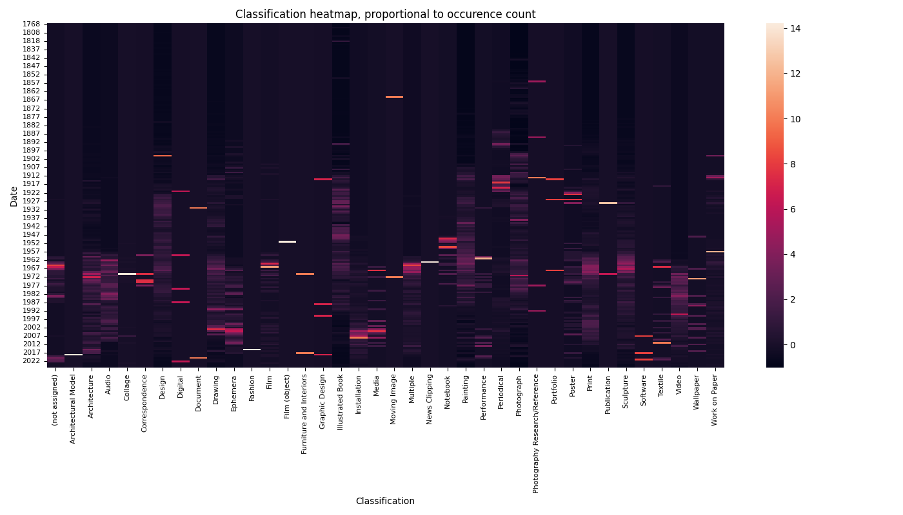
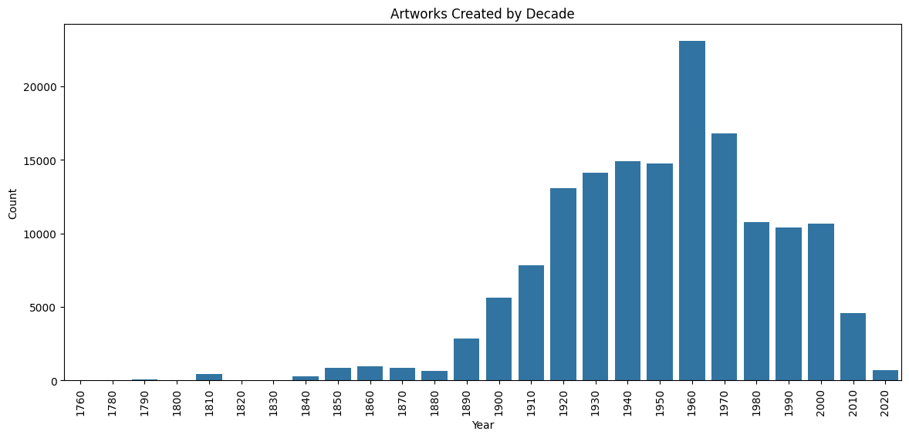
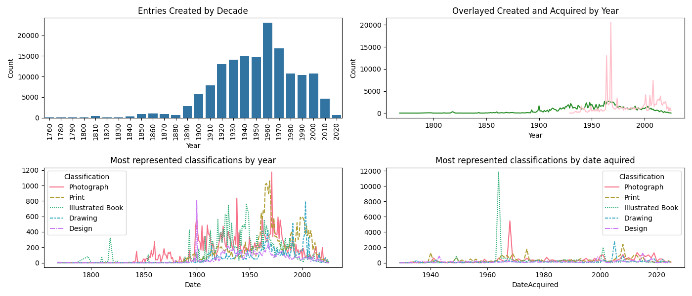
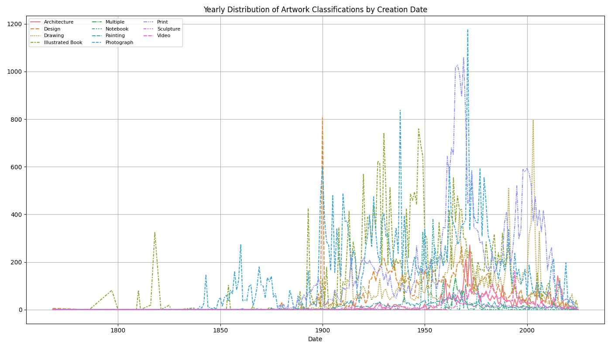
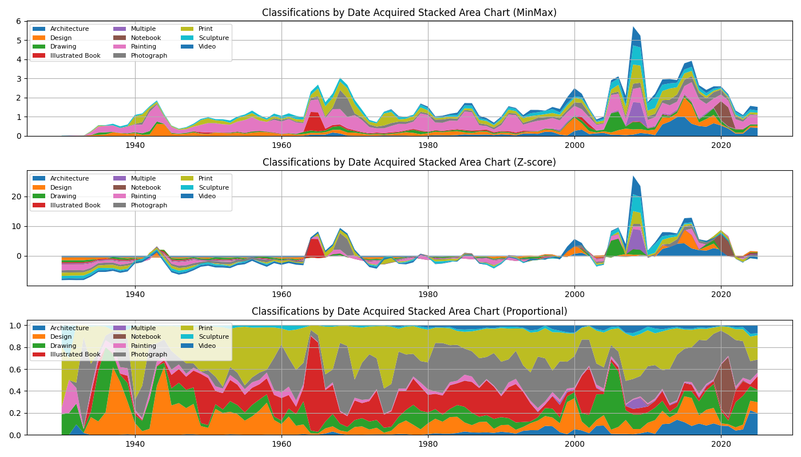
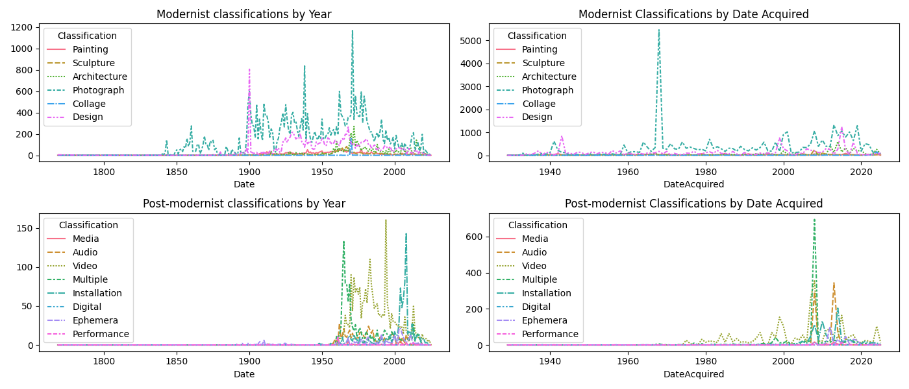
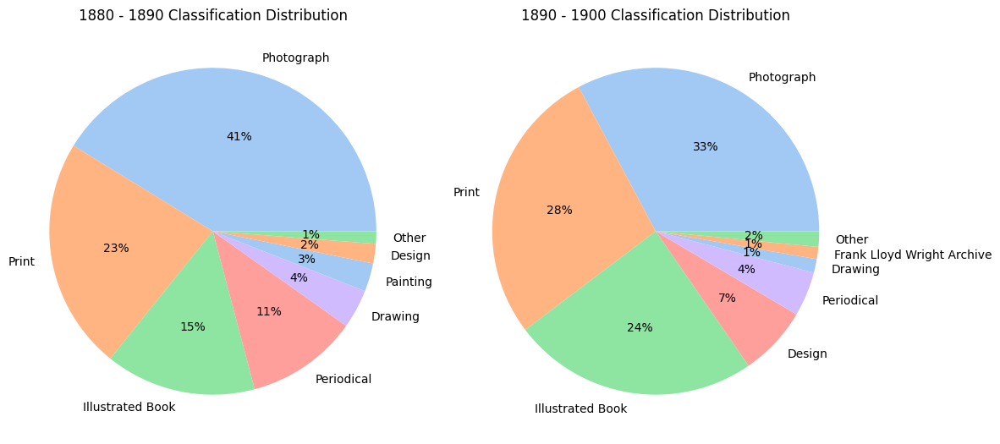
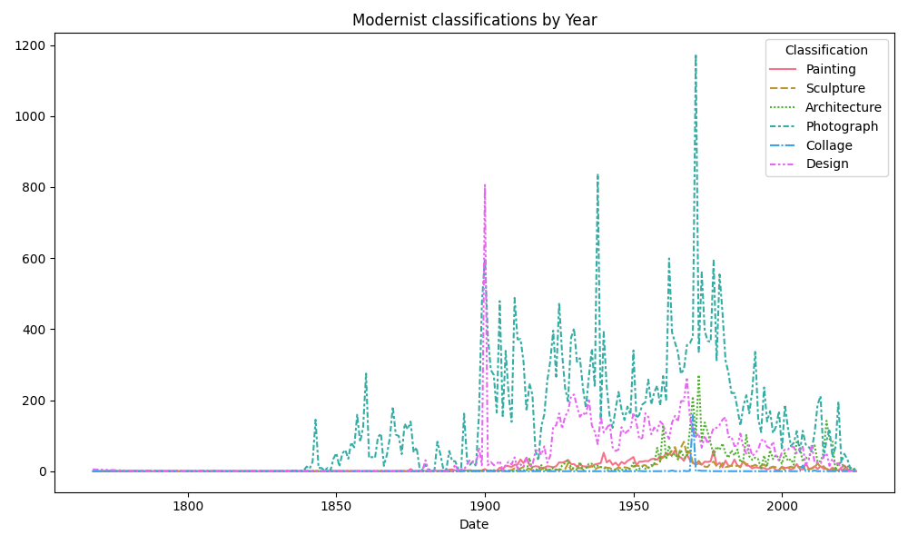
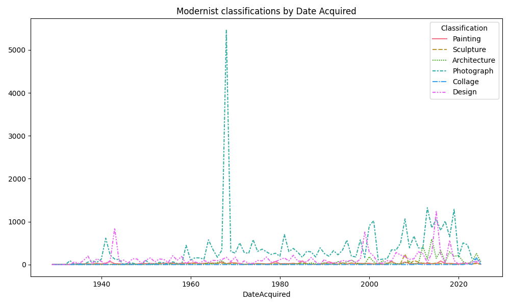

# Introduction to the MoMA Collection Using Data Science and Art-History (WIP)

## What Can Data Science Say About This Collection?
*editor’s note: Data Science, Machine Learning and Art History are rabbit holes. The louise project is an ongiong exploration of the [MOMA Collection](https://github.com/MuseumofModernArt/collection) that utilizes all three of these disciplines.*

*Please note that the data contained in this file emerged from a preliminary study of the subject. Further work is to be accomplished*

## About the museum
Information about the current MOMA collection:

The MOMA counts 159716 artworks by 15720 artists from 139 nationalities

**The MOMA currently counts 8 departments with 40 different classifications and 22944 mediums**

The earliest artwork dates back to: 1768 and latest: 2025

The earliest acquired entry dates back to: 1929-11-19 and latest: 2025-06-10

## Understanding MoMA Collection Timeline
To establish an understanding if the MoMA Colection Dataset, we will define the following categories that will guide our research:

|                Categories of Interest for Timeline Analysis                     |
|-------------------------------------|
| Date                                |
| DateAcquired                        |
| Classification                      |
| Department                          |
| Medium                              |

### Detailed entries of Departments, Classification, Medium
#### Departments
| Department                            | Count |
| ------------------------------------- | ----- |
| Drawings & Prints                     | 81444 |
| Architecture & Design                 | 34592 |
| Photography                           | 33653 |
| Painting & Sculpture                  | 4067  |
| Media and Performance                 | 3224  |
| Fluxus Collection                     | 1683  |
| Film                                  | 1022  |
| Architecture & Design - Image Archive | 31    |

#### Classifications
| Classification                 | Count |
| ------------------------------ | ----- |
| Photograph                     | 34872 |
| Print                          | 32905 |
| Illustrated Book               | 28264 |
| Mies van der Rohe Archive      | 17109 |
| Drawing                        | 14262 |
| Design                         | 12341 |
| Architecture                   | 4305  |
| Painting                       | 2438  |
| Video                          | 2437  |
| Notebook                       | 1981  |
| Sculpture                      | 1793  |
| Multiple                       | 1184  |
| Periodical                     | 951   |
| Installation                   | 913   |
| Frank Lloyd Wright Archive     | 869   |
| Audio                          | 794   |
| (not assigned)                 | 687   |
| Ephemera                       | 614   |
| Work on Paper                  | 394   |
| Collage                        | 189   |
| Film                           | 148   |
| Poster                         | 91    |
| Media                          | 41    |
| Textile                        | 34    |
| Performance                    | 33    |
| Wallpaper                      | 23    |
| Correspondence                 | 8     |
| Photography Research/Reference | 6     |
| Digital                        | 5     |
| Graphic Design                 | 4     |
| Software                       | 3     |
| Publication                    | 3     |
| Portfolio                      | 3     |
| Document                       | 3     |
| Moving Image                   | 2     |
| Film (object)                  | 2     |
| Furniture and Interiors        | 2     |
| Fashion                        | 1     |
| Architectural Model            | 1     |
| News Clipping                  | 1     |

##### Mediums (top 10)
| Medium                  | Count |
| ----------------------- | ----- |
| Gelatin silver print    | 17011 |
| Lithograph              | 8656  |
| Pencil on paper         | 7293  |
| Albumen silver print    | 4839  |
| Pencil on tracing paper | 3279  |
| Oil on canvas           | 2450  |
| Woodcut                 | 2200  |
| Graphite on paper       | 1800  |
| Watercolor on paper     | 1750  |
| Ink on paper            | 1600  |

## Exploring the Collections overtime

Now that we have a better understanding about the collection's data structure, let's dive into our first graphs focusing on Creation Date, Classifications and Date Acquired

# MoMA Dataset Timelines
And more Graphs!

*From top left to bottom right:*

| Timeline                                    | Description |
|---------------------------------------------|-------------|
| Entries Created By Decade                               | Timeline of artworks based on their creation decade. |
| Creation Date Overlayed With Date Acquired  | Comparison of when artworks were created vs. when they entered the collection. |
| Most Represented Classifications            | Distribution of classifications most frequently represented in the collection. |
| Most Represented Classifications By Date Acquired | Timeline showing when different classifications entered the collection most frequently. |

#### Distribution of Classifications by Date Created

Timeline showing the popularity of different classifications in the collection.

#### Classification Heatmap

Values represent the *relative distribution of classifications by year (heatmap)* within the collection. 

- **Color scale**:  
  - Light (≈14) → Higher than average occurence  
  - Dark purple (≈2) → More common / frequently represented  

#### Classifications by Date Acquired

The stacked area charts provide insight into the museum’s acquisition history, hightlighting shifts in trends.

#### Modernist and Post-Modernist Comparative Graphs

Lineplots showing comparaisons between Modern and Post-Modern art. These arbitrary boundries of time and classifications help us identify trends. 

## Case Study: What happened between 1880 and 1900? 

Looking at the period 1880-1900 in this graph, we can clearly see a sudden growth in the artworks present in the MoMA's collection.

Between 1768 and 1890 there was an averge of 34 artworks created per year.

After 1890 and until 2025 there was an average of 1112 artworks created per year 

What happened between 1880 and 1900? How can data science help us make sense of this?

The difference between the two is quite striking and we could easily suppose that this is due to society's growing adoption of industrialisation. 

Lets take a look at the different classifications of the artworks to see if this could give us more insight
Between 1880 and 1890 there was a total of 570 artworks against 2744 between 1890 and 1900

### 1880–1890 Classification Counts

| Classification                     | Count |
|-----------------------------------|-------|
| Photograph                         | 235   |
| Print                               | 131   |
| Illustrated Book                    | 85    |
| Periodical                          | 63    |
|     ...                                  ||
| Photography Research/Reference       | 1    |
| TOTAL                                 |570|

### 1890–1900 Classification Counts

| Classification                     | Count |
|-----------------------------------|-------|
| Photograph                         | 900   |
| Print                               | 755   |
| Illustrated Book                    | 667   |
| Design                              | 189   |
|     ...                                  ||
| Architecture                         | 6     |
| TOTAL                                 |2744|

We can observe the overall stability of Photographs, Print and Illustred Books. We must note the clear emergence of design. Further reinforced by the follwing graph which clearly shows the sudden popularity of design made during the early XXth century within the MoMA's collection. 

**1880-1890**
| DateAcquired | Classification   | Date | Count |
| ------------ | ---------------- | ---- | ----- |
| 1975         | Illustrated Book | 1889 | 71    |
| 1937         | Photograph       | 1884 | 47    |
| 1967         | Photograph       | 1885 | 41    |
| 1989         | Photograph       | 1888 | 32    |
| 1944         | Photograph       | 1884 | 29    |

**1890-1900**
| DateAcquired | Classification   | Date | Count |
| ------------ | ---------------- | ---- | ----- |
| 1964         | Illustrated Book | 1893 | 402   |
| 1968         | Photograph       | 1899 | 239   |
| 1965         | Photograph       | 1899 | 152   |
| 1989         | Photograph       | 1893 | 147   |
| 1968         | Photograph       | 1898 | 128   |

The previous tables tell us that design made between 1880 - 1900 is not acquired in large quantities by the museum. Yet, this classification remains one of the most important as shown by this graph.

This lets us conclude, that during the the last twenty years of the XIXth century 1880-1890 was caracterized by the emergence of design which would then go on to become increasingly popular in the MoMA's collection.

# run this project 
- Install Python 
- Install UV 
- Run `uv sync`
- Run `make get-general`
- Run `make get-visualisation`

# Source 
[MOMA Collection](https://github.com/MuseumofModernArt/collection) 

